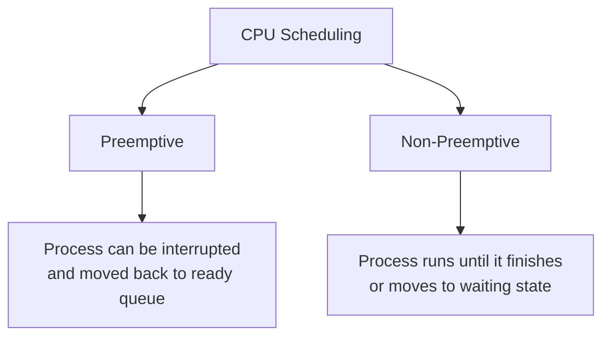
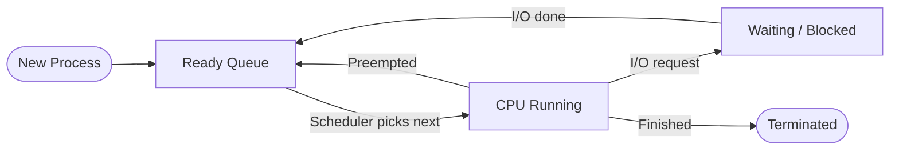

# CPU Scheduling in Operating Systems

> **Reference:** [CPU Scheduling in Operating Systems — GeeksforGeeks](https://www.geeksforgeeks.org/operating-systems/cpu-scheduling-in-operating-systems/)

---

## Overview
CPU scheduling is the process used by the operating system to decide which task or process gets to use the CPU at a particular time. Since a CPU can only handle one task at a time, but many tasks are always waiting, scheduling ensures fair, efficient use of the CPU.

**Goals of CPU Scheduling:**
- Maximize CPU utilization
- Minimize response and waiting time
- Maximize throughput

---

## Key Terminologies

| Term | Definition |
| --- | --- |
| Arrival Time | Time at which the process arrives in the ready queue. |
| Burst Time | Time required by the process for CPU execution. |
| Completion Time | Time at which the process completes execution. |
| Turn Around Time | `Completion Time − Arrival Time` |
| Waiting Time | `Turn Around Time − Burst Time` |
| Response Time | Time from submission of request to first response. |

---

## Important Factors

| Factor | Description |
| --- | --- |
| CPU Utilization | Keep CPU as busy as possible (40–90% in real systems). |
| Throughput | Number of processes completed per unit time. |
| Turn Around Time | Total time taken from arrival to completion. |
| Waiting Time | Time spent waiting in the ready queue. |
| Response Time | Time until the first response is produced. |

---

## Types of Scheduling



---

## Scheduling Algorithms

### 1. FCFS — First Come First Serve
- Processes are executed in the order they arrive.
- Non-preemptive.
- Simple but can cause the **convoy effect** (long processes block short ones).

### 2. SJF — Shortest Job First
- Process with the shortest burst time runs next.
- Non-preemptive; gives minimum average waiting time.
- Can cause **starvation** for long processes.

### 3. SRTF — Shortest Remaining Time First
- Preemptive version of SJF.
- A running process is preempted if a new shorter job arrives.

### 4. Round Robin (RR)
- Each process gets a fixed **time quantum** in a circular order.
- Preemptive; fair to all processes.
- Performance depends heavily on the time quantum size.

### 5. Priority Scheduling
- Each process is assigned a priority; highest priority runs first.
- Can be preemptive or non-preemptive.
- Risk of **starvation** for low-priority processes (solved by **aging**).

---

## Algorithm Comparison

| Algorithm | Preemptive | Starvation | Best For |
| --- | --- | --- | --- |
| FCFS | No | No | Simple batch systems |
| SJF | No | Yes | Minimising average wait time |
| SRTF | Yes | Yes | Short-job-heavy workloads |
| Round Robin | Yes | No | Time-sharing / interactive systems |
| Priority (preemptive) | Yes | Yes | Real-time systems |
| Priority (non-preemptive) | No | Yes | Batch systems |

---

## Diagram: Scheduling Flow



---

## Python Demo

The `CPU-Scheduling/` folder contains a working Python demo (`cpu_scheduling.py`) implementing four algorithms: **FCFS, SJF, Round Robin, and Priority**.

Run the unit tests:
```bash
cd CPU-Scheduling
/usr/local/bin/python3 -m unittest test_cpu_scheduling.py -v
```

---

## Test Results

```
test_fcfs ... 

──────────────────────────────────────────────────────────
  ALGORITHM: First Come First Serve (FCFS)
──────────────────────────────────────────────────────────
  Process   Arrival  Burst  Completion  TAT  Waiting
  -------   -------  -----  ----------  ---  -------
  P1        0        5      5           5    0
  P2        1        3      8           7    4
  P3        2        8      16          14   6
  P4        3        6      22          19   13
──────────────────────────────────────────────────────────
  Avg Turn Around Time : 11.25
  Avg Waiting Time     : 5.75
──────────────────────────────────────────────────────────

ok
test_priority ...

──────────────────────────────────────────────────────────
  ALGORITHM: Priority Scheduling (Non-Preemptive)
──────────────────────────────────────────────────────────
  Process   Arrival  Burst  Priority  Completion  TAT  Waiting
  -------   -------  -----  --------  ----------  ---  -------
  P1        0        5      2         5           5    0
  P3        2        8      1         13          11   3
  P2        1        3      3         16          15   12
  P4        3        6      4         22          19   13
──────────────────────────────────────────────────────────
  Avg Turn Around Time : 12.50
  Avg Waiting Time     : 7.00
──────────────────────────────────────────────────────────

ok
test_round_robin ...

──────────────────────────────────────────────────────────
  ALGORITHM: Round Robin (Time Quantum = 3)
──────────────────────────────────────────────────────────
  Process   Arrival  Burst  Completion  TAT  Waiting
  -------   -------  -----  ----------  ---  -------
  P2        1        3      6           5    2
  P1        0        5      14          14   9
  P4        3        6      20          17   11
  P3        2        8      22          20   12
──────────────────────────────────────────────────────────
  Avg Turn Around Time : 14.00
  Avg Waiting Time     : 8.50
──────────────────────────────────────────────────────────

ok
test_sjf ...

──────────────────────────────────────────────────────────
  ALGORITHM: Shortest Job First (SJF)
──────────────────────────────────────────────────────────
  Process   Arrival  Burst  Completion  TAT  Waiting
  -------   -------  -----  ----------  ---  -------
  P1        0        5      5           5    0
  P2        1        3      8           7    4
  P4        3        6      14          11   5
  P3        2        8      22          20   12
──────────────────────────────────────────────────────────
  Avg Turn Around Time : 10.75
  Avg Waiting Time     : 5.25
──────────────────────────────────────────────────────────

ok

----------------------------------------------------------------------
Ran 4 tests in 0.001s

OK
```

### What the Results Tell You

| Algorithm | Avg Waiting Time | Avg TAT | Key Observation |
| --- | --- | --- | --- |
| FCFS | 5.75 | 11.25 | Simple but P4 waits 13ms — convoy effect. |
| SJF | 5.25 | 10.75 | Lowest wait time — shortest jobs go first. |
| Round Robin (TQ=3) | 8.50 | 14.00 | Fair but higher overhead with small quantum. |
| Priority | 7.00 | 12.50 | Higher priority jobs finish faster; lower ones wait longer. |

> **Key insight:** SJF gives the minimum average waiting time but risks starvation for long processes. Round Robin is the fairest but has higher average TAT. FCFS is the simplest and Round Robin is best for interactive systems.

---

## Summary
CPU scheduling is a core OS function that decides which process runs on the CPU next. Different algorithms trade off between fairness, throughput, and latency. Choosing the right one depends on the workload: batch jobs favour SJF, interactive systems favour Round Robin, and real-time systems favour Priority scheduling.
