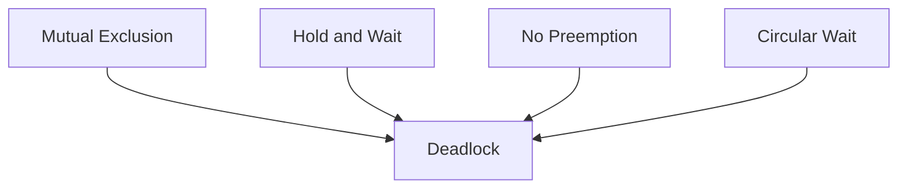
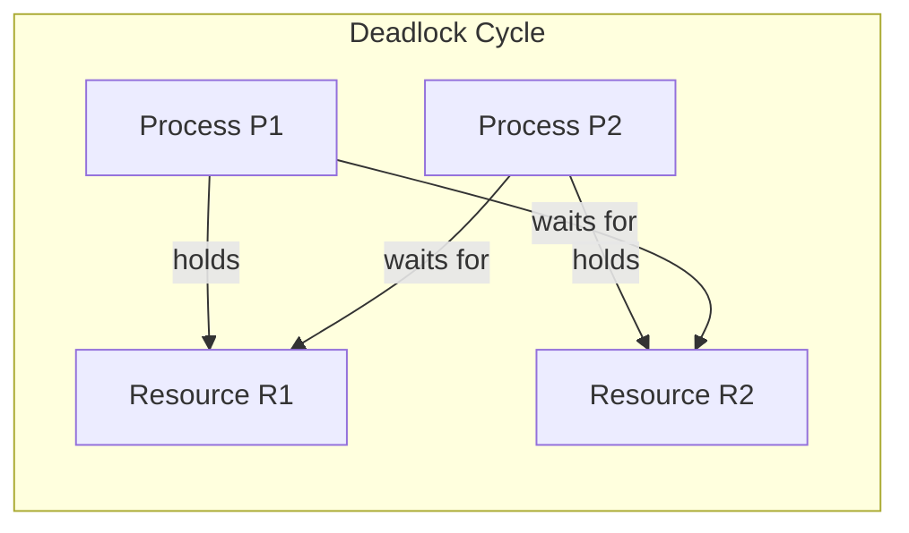

# Deadlock in Operating Systems

## Overview
A **deadlock** is a situation in which two or more processes are permanently blocked because each process is waiting for a resource held by another process in the same group. Since none of the processes can proceed, the system appears to freeze for those tasks.

Deadlock is common in operating systems, databases, distributed systems, and multithreaded applications where shared resources must be coordinated carefully.

## Simple Definition
A deadlock happens when:
- Process A holds Resource 1 and waits for Resource 2
- Process B holds Resource 2 and waits for Resource 1
- Neither process can continue, so both wait forever

## Necessary Conditions for Deadlock
Deadlock can occur only when all four of these conditions exist at the same time:

| Condition | Meaning |
| --- | --- |
| Mutual Exclusion | Only one process can use a resource at a time. |
| Hold and Wait | A process holds one resource while waiting for another. |
| No Preemption | A resource cannot be forcibly taken away. |
| Circular Wait | A cycle of processes waits on one another. |

### 1. Mutual Exclusion
At least one resource must be non-shareable. Only one process can use it at a time.

### 2. Hold and Wait
A process holds one or more resources while waiting to acquire additional resources.

### 3. No Preemption
Resources cannot be forcibly taken away from a process. The process must release them voluntarily.

### 4. Circular Wait
A circular chain of processes exists, where each process waits for a resource held by the next process in the chain.

## Mermaid Diagram: Deadlock Conditions

## Mermaid Diagram

## Real-World Example
Imagine two printers and two processes:
- Process P1 gets Printer A and waits for Printer B
- Process P2 gets Printer B and waits for Printer A
- Both printers are locked, and both processes wait forever

This is a classic deadlock cycle.

| Process | Holds | Requests |
| --- | --- | --- |
| P1 | Printer A | Printer B |
| P2 | Printer B | Printer A |

## Another Example: Tape Drives
If a system has only two tape drives:
- P0 holds one tape drive and requests the second
- P1 holds the second tape drive and requests the first
- Neither can move forward

| Process | Step 1 | Step 2 | Result |
| --- | --- | --- | --- |
| P0 | Holds tape drive 1 | Requests tape drive 2 | Blocks |
| P1 | Holds tape drive 2 | Requests tape drive 1 | Blocks |

## Deadlock in Semaphores
Semaphores can also cause deadlock when processes lock resources in different orders.

Example:
- P0 executes `wait(A)` then requests `wait(B)`
- P1 executes `wait(B)` then requests `wait(A)`
- Both processes block forever

## Effects of Deadlock
Deadlock can lead to:
- Poor resource utilization
- Process starvation
- Reduced system throughput
- Frozen threads or tasks
- Application hangs or service degradation

## Strategies to Handle Deadlock
Operating systems usually handle deadlock in one of four ways:

### 1. Deadlock Prevention
Design the system so that at least one of the four necessary conditions can never happen.

Common techniques:
- Avoid hold and wait by requiring all resources at once
- Allow preemption where possible
- Enforce a strict ordering of resource requests to break circular wait

### 2. Deadlock Avoidance
Make resource allocation decisions carefully so the system never enters an unsafe state.

The most well-known method is **Banker’s Algorithm**.

### 3. Deadlock Detection
Allow deadlocks to occur, then detect them using algorithms such as:
- Resource allocation graphs
- Wait-for graphs

### 4. Recovery
Once a deadlock is found, recover by:
- Terminating one or more processes
- Preempting resources
- Rolling back to a safe state

## Prevention Techniques in Practice
A few practical methods used in systems design:
- Request resources in a fixed global order
- Keep critical sections short
- Avoid holding locks while doing long I/O operations
- Use timeouts for lock acquisition
- Prefer deadlock-safe locking patterns

## Detection Example
A wait-for graph can help identify deadlock:
- If the graph contains a cycle, deadlock may exist
- Each node represents a process
- An edge means one process is waiting for another

## Recovery Example
If a deadlock is detected in a database system:
- The system may abort one transaction
- Release its locks
- Let other transactions continue
- Restart the aborted transaction later

## Summary
Deadlock is a serious concurrency problem where processes wait forever for resources held by each other. It occurs only when mutual exclusion, hold and wait, no preemption, and circular wait all exist together. Good resource ordering, prevention strategies, and detection mechanisms help systems avoid or recover from deadlocks.
