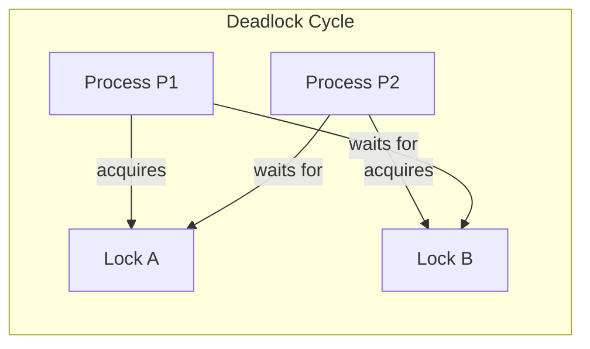

# Deadlock Process Diagram

## How the demo works
- P1 locks A first, then tries to lock B.
- P2 locks B first, then tries to lock A.
- Each process waits for a lock held by the other process.
- The demo uses a timeout so it shows the deadlock pattern safely without freezing forever.
