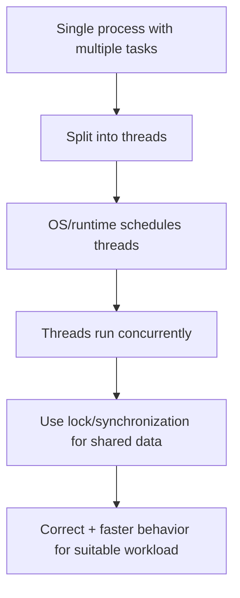
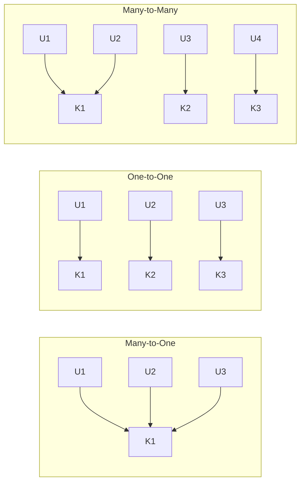

# Multithreading in Operating Systems (Python + Tests)

> Reference concept source: [Multithreading in OS — GeeksforGeeks](https://www.geeksforgeeks.org/operating-systems/multithreading-in-operating-system/)

---

## What is it?
Multithreading means splitting one process into multiple lightweight execution units called threads, so tasks can run concurrently.

## What is it used for?
- Better responsiveness (UI, web servers, background tasks)
- Better utilization of waiting time in I/O-heavy programs
- Handling multiple requests concurrently

## Why is it important?
It is a core OS and systems design concept used in real applications (web, banking, telecom, distributed services).

## Workflow


---

## User Threads and Kernel Threads (models)

From OS perspective, common mapping models:

1. **Many-to-One**: many user threads -> one kernel thread
2. **One-to-One**: one user thread -> one kernel thread
3. **Many-to-Many**: many user threads mapped to many kernel threads



---

## Python practical understanding

In CPython:
- Threads are excellent for **I/O-bound** tasks.
- CPU-bound threading is limited by the **GIL** (Global Interpreter Lock).
- Shared mutable data needs synchronization (`Lock`) to avoid race conditions.

---

## Included Python files

- `multithreading_demo.py`
  - sequential vs threaded I/O comparison
  - sequential vs threaded CPU comparison
  - race condition simulation + lock-protected fix

- `test_multithreading_demo.py`
  - verifies I/O threading benefit
  - verifies CPU threading is not unrealistically faster
  - verifies lock-based correctness in shared counter updates

---

## How to run

```bash
cd Multithreading
/usr/local/bin/python3 -m unittest test_multithreading_demo.py -v
```

Optional demo run:
```bash
/usr/local/bin/python3 multithreading_demo.py
```

---

## Expected learning from test results

1. **I/O-bound**: threaded often finishes much faster than sequential.
2. **CPU-bound** (CPython): threaded is usually similar or slower due to GIL.
3. **Shared state**: no lock can cause inconsistent values; lock gives correctness.

## Test result snapshot (executed)

```text
test_cpu_threading_not_massively_faster ...
Sequential CPU: 0.0361s
Threaded   CPU: 0.0319s
ok

test_io_threading_is_faster_than_sequential ...
Sequential I/O: 0.5062s
Threaded   I/O: 0.0855s
ok

test_lock_prevents_counter_race ...
Expected   : 4000
No lock    : 539
With lock  : 4000
ok

Ran 3 tests in 0.698s
OK
```

---

## Quick comparison table

| Workload type | Threading impact in CPython |
|---|---|
| I/O-bound | Usually strong benefit |
| CPU-bound | Limited benefit (GIL) |
| Shared mutable state | Needs lock/synchronization |

---

## Summary
Multithreading improves concurrency and responsiveness, but correct usage depends on workload type and synchronization discipline. In Python, use threading mainly for I/O-heavy workloads and use locks for shared data correctness.
